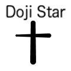



## Single Doji

> **Hint**. {{ page.hint }}

It look-a like this ...

{:width="120px"}

**Note**. A **Single Doji** performs an important alert at both the top and bottom of trend lines.

## Top-O-Trend

For example, at the top of a trend, the **Single Doji** signals an auto reversal without any requisite confirmation.

Whereas, the more modern *Heikin-Ashi* candles take into consideration the previous candle open and close thus setting up a potential **Double Doji** phenomenon.

## Heikin-Ashi Candles

When a set of identical **Single Doji** appear on a one-minute chart back-to-back, one should always take quick notice.

Remember, the open price for the 2nd candle in succession is de­rived from the pre­vi­ous can­dle open and close prices.

A simple average of the two previous price points creates the open price for the 2nd candle.

## Double Trouble

The  **Double Doji** is one of the most important *Heikin-Ashi* candle formation signals you will come across when trading ultra short term ie.) *when hypertrading*.

It look-a like this ...

{:width="120px"} {:width="120px"}

The formation is created when the opening price and closing price are the same on two separate, yet consecutive trading periods.

This forms a horizontal line.

The implication is that the bulls and the bears are in a state of indecision.

And, with a set of back-to-back *Heikin-Ashi* candles forming separate *doji*, with each respective market opening based on the average open and close of the previous candle, one can see the tightness of call.

## Run For The Hills

**Rule**. When a **Double Doji** appears in any other location on any given short term chart other than a trend line bottom ( including a trend line top ), close out your long position immediately.

If you are short, close out your short position immediately, other than at a trend line top ( including a trend line bottom ).

For ... a reset of the then formed trading mechanism is warranted.

If you are short, cover.

If you are long, sell.

And, don't forget to cancel your stop orders, either above the market, or below the market to guard against market "whiplash".

## Exception

The only exception is the case where the market is putting in a bottom, and the **Double Doji**, or **Single Doji** appear as *morning stars*.

The rule of thumb is that you should immediately put on a long position when the *morning star* appears.

You may, however, also wait to confirm the reversal by observing a subsequent bullish gap up the following trading period, but this is generally not necessary.

## Market Tops

The **Doji Star** is also an excellent danger sign when flashed as consecutive *evening stars*.

Upon site of a **Single Doji** or **Double Doji** near or at the top of a trend, you may wish to start implementing a short strategy.

Nothing is infallible, however, so please enter a corresponding **Buy Stop Loss** order for each short position when implementing your short-term "short" strategy.

## Summation

When the **Double Doji** appears in the form of consecutive *Heikin-Ashi* candles, close out your position, long or short and run for the hills.

EXCEPT when the market is putting in a bottom.

Then, you Buy, Buy, Buy ...!

### Flashes O Brilliance

Or, if flashed at the top of a trend line, you Short, Short, Short.

The key is to watch for the elusive **Double Doji** appearing anywhere else on the chart.

The default move is to liquidate your position and wait and observe to see how the chart reassembles itself after the appearance of the **Double Doji**.

Generally, in the process of an uptrend, a **Double Doji** appearing midstream will at the least spook and stall the rally.

Whereas, in the process of a downtrend, a **Double Doji** appearing midstream will tend to arrest the momentum of the declination.

Very strange omens, indeed!

### Immediate Action Required

Therefore, learn to trade these signals immediately.

**Caution**. You may not even have the time to confirm the MAC-D when a **Double Doji** appears.

So, pull the trigger promptly upon sight and wait for confirmation.

Re-entering the market on the long side can be achieved once the chart reassembles in a positive manner.

### Shorting Tops

Whereas, shorting immediately at the sight of a **Double Doji** is not without risks.

The closer to a top in the market when a  **Double Doji** does appear will dictate the probability of success for any short-term "short" strategy.

## Last Subtitle

More to come ...

***

**Note**. The above synopsis was derived from an article written by Blank Author [[1](#BLANKAUTHOR){:.red}].

1. {:#BLANKAUTHOR}[A Narrative of Psychology by Blank Author, Jan #1999](http://cowles.yale.edu/sites/default/files/files/pub/d20/d2069.pdf){:title="Click to Review ..."}{:target="_blank"}

***


